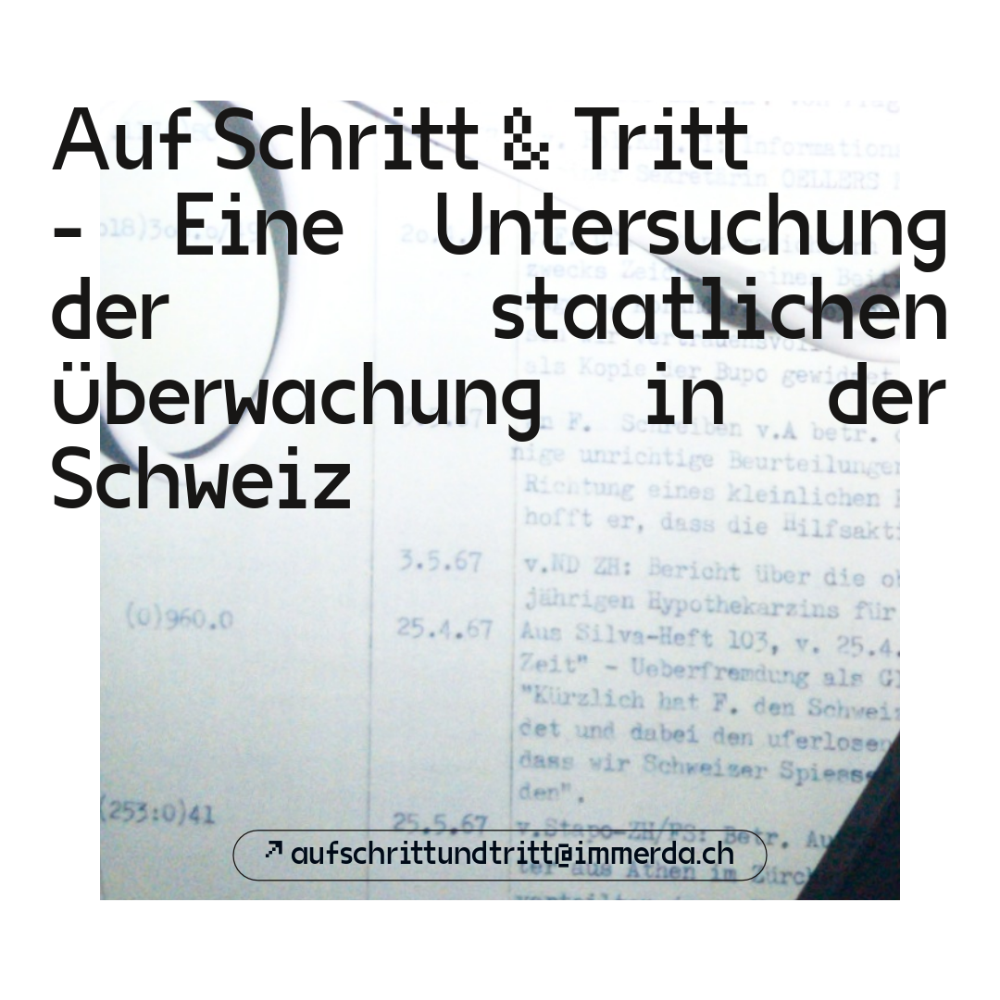

# Data Repository for Collected Sources

This repository serves as a centralized location for storing and managing "open source" data collected from various sources for our project. The data collected here is intended for research, analysis, and reference purposes of the mass surveilance programs by the swiss state and its institutions.

## Overview

- **Data Sources**: We have collected data from diverse sources, including ...

- **Data Format**: The raw data is stored in csv, compiled and normalized in json making it accessible and compatible with various data analysis tools and programming languages.

## Data Files

- `data_file1.csv`: Description of the data in this file.

## Data Usage

If you plan to use the data in this repository for your research, analysis, or any other purpose, please follow these guidelines:

- Provide appropriate attribution to the original sources (if applicable).
- Respect any licensing or usage restrictions associated with specific data files.
- Feel free to contribute improvements, updates, or additional data to this repository through pull requests.

## Contributing

We welcome contributions from the community to enhance the data collection and its quality.

## License

The data in this repository may have different licenses depending on its sources. Refer to the specific data files and sources for detailed information.

## Contact

For any questions, feedback, or inquiries regarding this data repository, please contact schrittundtritt@immerda.ch
We hope this data repository proves to be a valuable resource for your projects and research endeavors.
